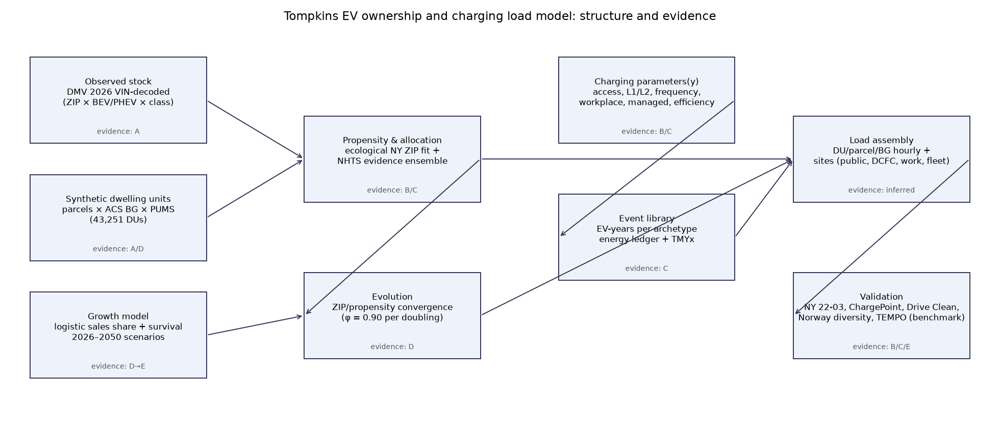
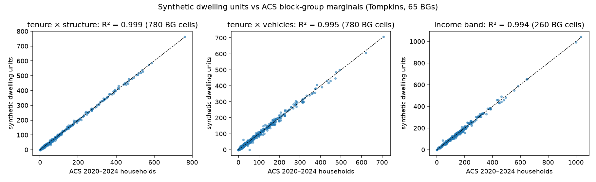
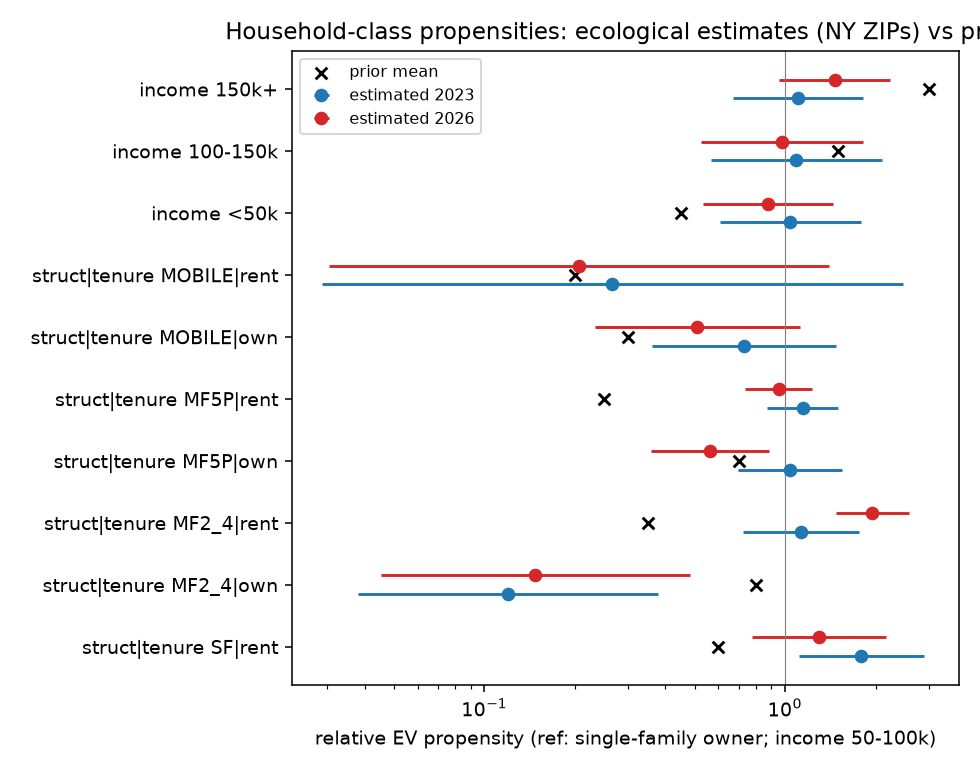
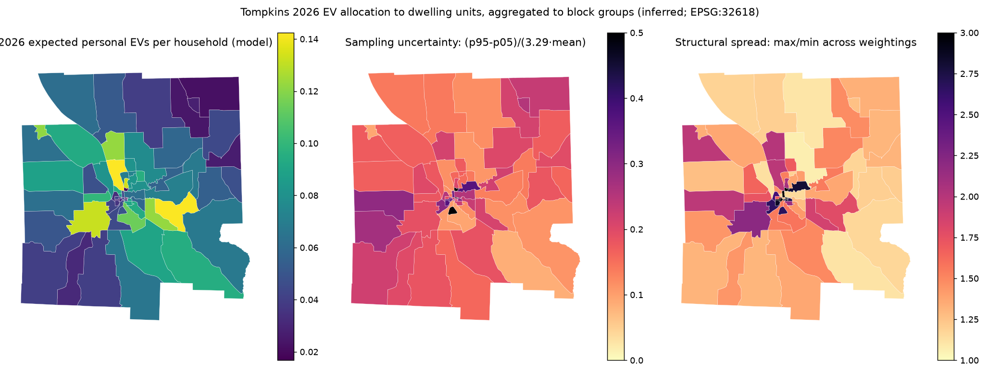
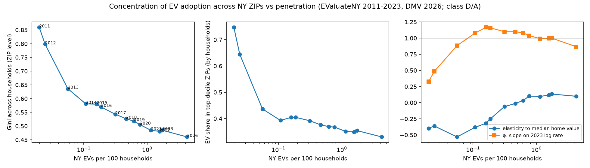
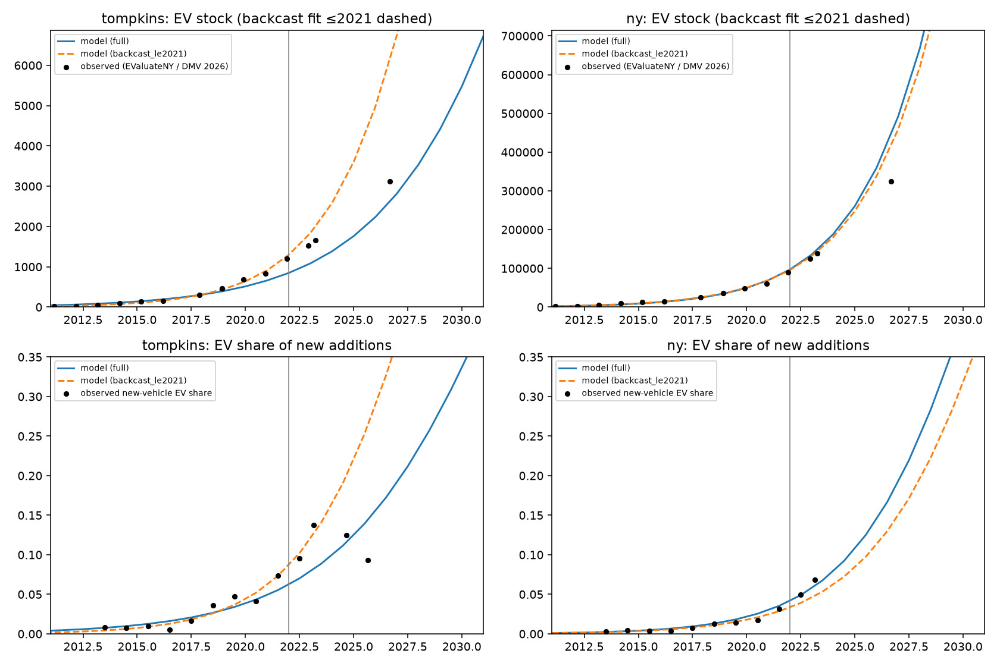
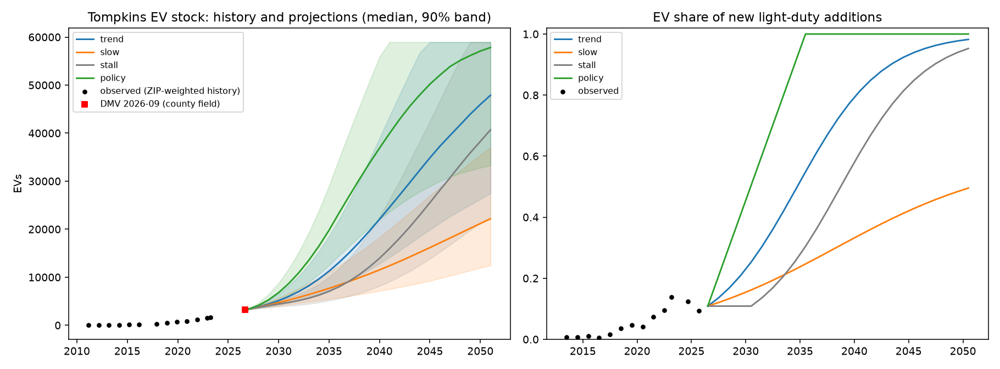
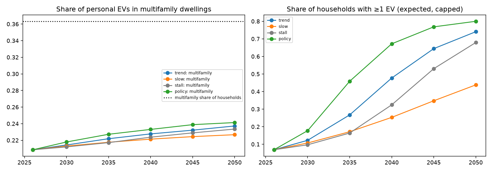

# Reading guide

**Audiences.** Utility planners and retailers: §1, §6–§7. UBEM validation team: §4–§7, `docs/ubem_interface.md`.
Municipal planners: §1, §4.4, §6. Researchers and students: everything, plus `docs/methodology.md`,
`docs/decisions/`, and the code in `src/`.

**Evidence labels** (used on every number): **[A]** local observation · **[B]** New York observation ·
**[C]** national/non-local observation · **[D]** derived/processed observation · **[E]** model output (external) ·
**inferred** = our model result conditional on stated assumptions.
Agreement with a class-E source is a *benchmark*, never *validation*.

**Reproducibility.** Every figure and table is produced by scripts listed in `docs/methodology.md` §1; raw data are
re-acquired by `src/acquisition/*`; provenance manifests are in `metadata/manifests/`.

---

<!-- SECTION 1 (executive summary) is inserted after the charging results are final -->

# 2. Data added in this phase (research plan step 3)

| Source | What it adds | Key numbers | Class |
|---|---|---|---|
| NYSERDA Statewide Multifamily Building Study 2022 (`gjv3-iq86`, `gfhm-wz4s`) | Multifamily parking, EV charging presence, panel capacity by utility region | Upstate NYSEG/RG&E: **84 %** of MF units in buildings with off-street parking (95 % CI 77–89); **5.7 %** of MF buildings with EV charging (2.1–10.0); 82 % of upstate units with ≥100 A panels. MF household EV ownership sample too small for a local rate (8/156 statewide; 0/17 NYSEG+RG&E). | B |
| Drive Clean survey parameter extraction (645 values) | Home access, L1/L2, charging frequency distributions, workplace/public use, cohort trends | BEV: 89 % charge at home, 58 % L2 station (+27 % 240 V outlet), frequency daily/few-weekly/weekly/rare/never = 34/28/20/7/11 %; PHEV 81 % home, 68 % 120 V, 51/15/4/10/19 %; 23 % workplace access (≈⅔ use). **No housing-type breakdowns are published.** | B (self-report, rebate recipients) |
| ACS 2020–2024 PUMS (PUMA 02300 = Tompkins) | Joint household attributes for synthetic dwellings | 2,084 occupied-household records, 43,260 weighted households | A (survey) |
| OneBuilding TMYx 2011–2025 Ithaca (KITH) | Hourly temperature for energy per mile | Jan mean −2.3 °C, Jul 21.9 °C | A (typical year) |
| EValuateNY first appearances + DMV transactions | Inflows of new/used vehicles by drivetrain 2012–2026 | EV share of new light-duty additions: 0.8 % (2013) → 9.5 % (2022) → 12.5 % (12 mo to Aug 2025) → 9.3 % (to Aug 2026) | D/A |
| AFDC historical stations | Unbiased infrastructure growth | see §5.6 (agent-acquired; status noted there) | A |

Details: `docs/source_notes/nyserda_smbs_2022.md`, `docs/source_notes/nyserda_drive_clean_surveys.md`,
`docs/data_sources.md`.

---

# 3. Model overview

The model has three coupled parts, each run for every year 2026–2050 and scenario:

1. **Ownership** — observed ZIP EV totals (2026) placed onto 43,251 synthetic dwelling units; county stock grows
   with a cohort stock–flow model; within-county placement evolves as adoption spreads.
2. **Charging behaviour** — a library of simulated EV-years (energy ledger, temperature, empirical plug-in and dwell
   times) for 52 behavioural archetypes; archetype probabilities depend on dwelling class and year.
3. **Load assembly** — hourly kWh per dwelling unit, parcel, block group and non-residential charging site.

| Scenario axis | Values | Varies |
|---|---|---|
| Ownership growth | `trend`, `slow`, `stall`, `policy` | EV share of new vehicle additions after 2026 |
| Charging | `base`, `access+`, `managed` | home access (multifamily/renters), workplace buildout, off-peak managed charging |

Basic unit: **dwelling unit** (synthetic household on a tax parcel). Parcels act as building proxies; block groups for
mapping and validation; sites for public/workplace/fleet charging.

---

# 4. Ownership model

## 4.1 Observed stock (status quo)

NYS DMV registrations (snapshot 2026-09-02) with VIN-pattern drivetrain decoding (NHTSA vPIC 89.8 %, EValuateNY
lookup 10.2 % of MY2011+ light-duty vehicles):

| Quantity | Value | Class |
|---|---|---|
| Tompkins plug-in EVs (county field, all classes) | **3,233** (1,833 BEV, 1,400 PHEV) | A |
| Share of light-duty vehicles | **5.36 %** (2nd of 62 NY counties; NY 3.14 %) | A/B |
| Personal (PAS light-duty) EVs allocated to housing | 2,875 in Tompkins-area ZIPs (61 at out-of-area addresses) | A |
| Fleet/organizational EVs | ≈ 297 (placed on non-residential parcels) | A |
| DMV `fuel_type = ELECTRIC` | misses essentially all PHEVs (coded GAS) | A — decision 0002 |

## 4.2 Synthetic dwelling units

Parcels (2025 roll) → dwelling-unit counts by property class, calibrated per block group to ACS occupied units by
structure type; each unit receives a PUMS household (tenure, income, vehicles, workers) drawn with weights raked (IPF)
to block-group marginals.

\[
w^{\text{BG}}_h \leftarrow w_h \cdot \frac{T_{c}}{\sum_{h' \in c} w_{h'}} \quad \text{iterated over margins } c \in \{\text{tenure}\times\text{structure},\ \text{tenure}\times\text{vehicles},\ \text{income}\}
\]

| Validation (65 BGs) | R² | SRMSE |
|---|---|---|
| tenure × structure cells | 0.999 | 0.063 |
| tenure × vehicles cells | 0.995 | 0.117 |
| income band cells | 0.994 | 0.065 |
| Total dwelling units | 43,251 vs ACS 43,263 households | — |

Structure composition: single-family detached 52 %, attached 4 %, 2–4 units 14 %, 5–19 units 12 %, 20+ units 11 %,
mobile 7 %. 1,723 ACS units had no parcel of the matching class in their BG and were placed on the nearest class.

## 4.3 Household-class EV propensity (ecological calibration)

Expected EVs in ZIP \(z\) under a mean-field approximation over ACS composition:

\[
\mu_z = e^{\beta_0 + \gamma^\top Z_z}\; I_z \sum_{\tau\in\{\text{own,rent}\}} HH_{z,\tau}\; A_{z,\tau}\; V_{z,\tau},\qquad
EV_z \sim \text{NegBin}(\mu_z, \alpha)
\]
\[
A_{z,\tau} = \sum_g s_{g\mid\tau,z}\, e^{a_{g,\tau}},\qquad V_{z,\tau} = \sum_{v\ge1} s_{v\mid\tau,z}\, v^{\eta},\qquad I_z = \sum_i s_{i,z}\, e^{c_i}
\]

\(Z_z\): standardized log median home value and bachelor's-degree share. Tempered-prior variants set
\(a = \omega \log a^{\text{prior}},\ c = \omega \log c^{\text{prior}}\) (priors from NHTS 2022 and Drive Clean
representation ratios). Validation: 10-fold **county-grouped** cross-validation over 1,361 NY ZIPs, plus a
*within-county allocation* test where held-out county totals are known and distributed across ZIPs.

| Model | Deviance explained vs households-only, 2023 | 2026 | Within-county allocation MAE (EVs/ZIP), fit 2023 → allocate 2026 |
|---|---|---|---|
| M0 households only | 0 | 0 | 68.6 |
| M1 vehicles only | **0.803** | **0.783** | 64.1 |
| M2 priors fixed (NHTS/Drive Clean) | 0.657 | 0.652 | 79.1 |
| M3 free class effects | 0.786 | 0.763 | **62.6** |
| M4 free class effects, no area terms | 0.741 | 0.729 | 75.6 |
| M5 tempered priors (selected) | 0.790 | 0.753 | 63.6 |
| M6 separately tempered | 0.788 | 0.753 | 63.6 |

**Findings.** Once vehicles available and area effects are included, ZIP-level variation places almost no weight on
individual-level housing/tenure/income priors (ω = 0.00 ± 0.07 in 2023; 0.04 ± 0.06 in 2026); EVs scale
sub-proportionally with vehicles (η ≈ 0.5–0.8). Imposing full priors *worsens* allocation below uniform because
multifamily and renter households already have fewer vehicles (double counting). Free class effects are ecologically
confounded (e.g., 2–4-unit owners 0.12×) and are not used for placement. Individual-level NHTS evidence (income
OR 6.7 for ≥$150k vs <$50k; single-family OR 1.3, n.s.) remains the only evidence on *within-area* composition effects.

## 4.4 Allocation to dwelling units (2026)

For ZIP \(z\) with observed personal EVs \(T_z\), each weighting \(w^{(m)}\) gives capped expectations

\[
E^{(m)}_d = \min\!\Big(v_d,\ T_z \frac{w^{(m)}_d}{\sum_{d' \in z} w^{(m)}_{d'}}\Big)\ \text{(excess redistributed)},\qquad
E_d = \tfrac12\big(E^{(\text{model})}_d + E^{(\text{individual})}_d\big)
\]

with \(w^{(\text{model})}_d = e^{\gamma^\top Z_{bg}}\, v_d^{\eta}\) (selected ecological model) and
\(w^{(\text{individual})}_d = v_d \cdot OR_{\text{income}} \cdot OR_{\text{SF}} \cdot OR_{\text{tenure}}\) (NHTS 2022).
Monte Carlo realizations (200 draws) sample vehicle slots without replacement and pick one weighting per draw.

| Share of personal EVs, 2026 | Central | Ecological | Uniform | Vehicles | Individual (NHTS) | Full priors |
|---|---|---|---|---|---|---|
| Multifamily (2+ units) | **20.9 %** | 26.6 % | 30.9 % | 25.4 % | 15.1 % | 9.2 % |
| Renters | **28.0 %** | 35.8 % | 40.9 % | 35.7 % | 20.3 % | 10.4 % |
| Households (for reference) | MF 36.3 % | | | | | |

Block-group totals differ by up to 2–3× across weightings in central Ithaca; sampling uncertainty is 10–50 % of the
mean at BG level. **Reproducing ZIP totals validates nothing below ZIP** (decision 0005).

## 4.5 How concentrated is adoption, and how does it change?

| NY snapshot | EVs / 100 households | Gini across households (ZIP level) | Top-decile ZIP share of EVs | Slope of log ZIP rate on 2023 log rate |
|---|---|---|---|---|
| 2011 | 0.02 | 0.86 | 75 % | 0.32 |
| 2016 | 0.19 | 0.57 | 41 % | 1.16 |
| 2020 | 0.77 | 0.51 | 37 % | 1.04 |
| 2023 | 1.73 | 0.49 | 35 % | 1.00 |
| 2026 | 4.23 | **0.46** | **33 %** | **0.87** |

Adoption becomes less concentrated as penetration rises; relative ZIP differences compress by a factor
\(\varphi \approx 0.87\) over 2023→2026 (≈ 0.90 per doubling of penetration). This exponent drives how placement
converges in projections (§4.7). [D/A]

## 4.6 County growth model

Cohort stock–flow with logistic adoption of new-vehicle additions and Weibull survival:

\[
s(v) = \frac{1}{1+e^{-k(v-t_0)}},\qquad A(v) = N_{\text{new}}\, m\, s(v),\qquad
EV(t) = \sum_v A(v)\, S(t-v-\tfrac12),\qquad S(a) = e^{-(a/\lambda)^{\kappa}}
\]

(\(N_{\text{new}} = 3{,}600\) new light-duty additions/yr, \(\kappa = 3.5\), \(\lambda = 17\) y; \(m\) absorbs net
used-EV imports). BEV share of additions \(b(v)\) is a separate logistic. Calibration uses 2011–2026 stock and
new-vehicle share observations.

| Fit | \(t_0\) | \(k\) | \(m\) |
|---|---|---|---|
| Tompkins, all data | 2032.7 (±1.0) | 0.254 (±0.025) | 1.11 (±0.31) |
| Tompkins, ≤2021 only | 2028.5 | 0.364 | 1.77 |
| New York, all data | 2031.2 | 0.340 | 0.95 |

**Backcast validation** (fit ≤2021, predict later observations):

| Geography | 2023-04 stock | 2026-09 stock | New-vehicle share 2025–26 |
|---|---|---|---|
| New York | +3 % | **+27 %** | — |
| Tompkins | +21 % | **+90 %** | +60 % to +185 % |

Early-diffusion extrapolation overshoots the 2024–26 slowdown (end of the federal tax credit in 2025, observed dip in
new-vehicle EV share). Projections therefore **start from the observed 2026 stock by model year** and use scenario
paths for \(s(y)\) anchored at the observed recent share \(s_{\text{obs}} = 10.9\,\%\).

| Scenario (definition after 2026) | 2030 EVs (p05–p95) | 2035 | 2040 | 2050 | 2050 fleet share |
|---|---|---|---|---|---|
| trend — fitted steepness, \(s_{\max}=1\) | 5,995 (4,683–8,223) | 13,097 | 24,578 | 47,874 | 80 % |
| slow — \(s_{\max}=0.6\), half steepness | 5,249 | 8,388 | 12,397 | 22,161 | 37 % |
| stall — flat until 2030, trend shifted +4 y | 4,752 | 8,020 | 15,975 | 40,681 | 68 % |
| policy — linear to 100 % of additions by 2035 | 8,686 | 23,409 | 39,955 | 57,825 | 97 % |

Parameter uncertainty (400 draws of \(t_0, k, m\); \(N_{\text{new}}\) ±15 %; \(\lambda\) ±2 y) dominates after 2035
(trend 2040 90 % band 14,155–43,521). [inferred / E]

## 4.7 Placement evolution

\[
\pi_z(y) \propto \pi_z(2026)^{\varphi(y)}\, h_z^{1-\varphi(y)},\qquad w_d(y) = w_d^{\varphi(y)},\qquad
\varphi(y) = 0.90^{\log_2\left(EV(y)/EV(2026)\right)}
\]

| Trend scenario | 2026 | 2030 | 2035 | 2040 | 2050 |
|---|---|---|---|---|---|
| Personal EVs in Tompkins-area ZIPs | 2,967 | 5,294 | 11,566 | 21,704 | 42,277 |
| φ | 1.00 | 0.92 | 0.81 | 0.74 | 0.67 |
| Multifamily share of personal EVs | 20.9 % | 21.4 % | 22.2 % | 22.8 % | 23.7 % |
| Households with ≥1 EV (expected) | 6.9 % | 12.2 % | 26.7 % | 47.7 % | 74.1 % |

<!-- SECTIONS 5-8 (charging, load results, validation summary, limitations) are inserted after the final runs -->
