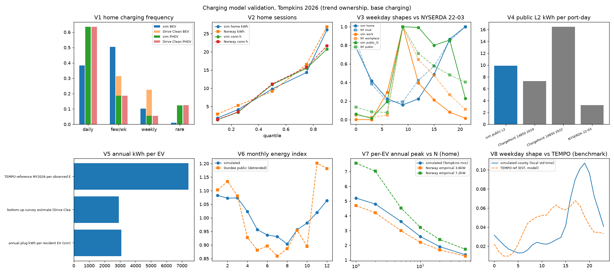
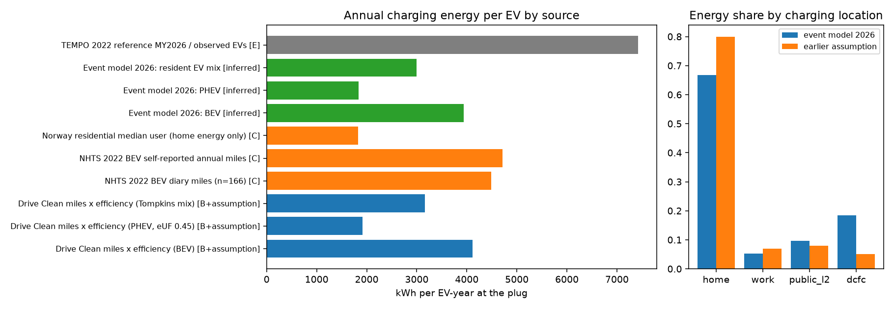
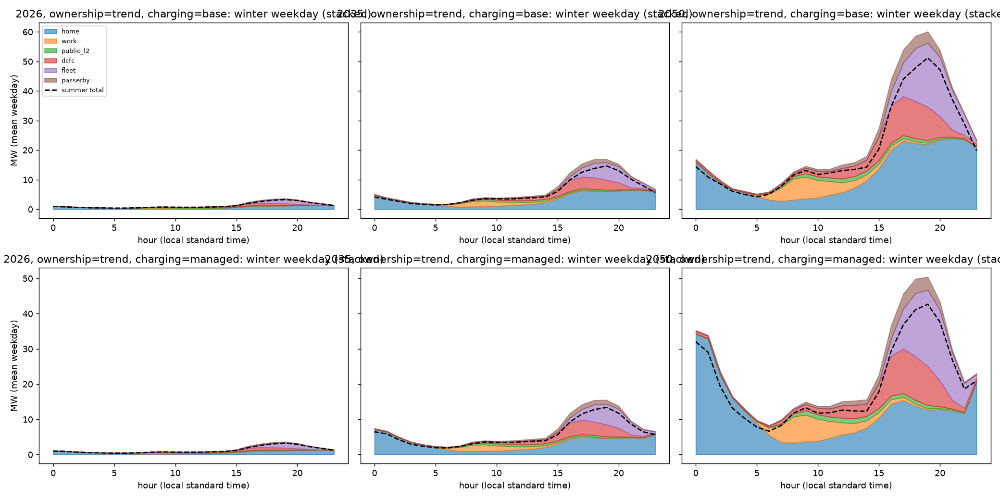
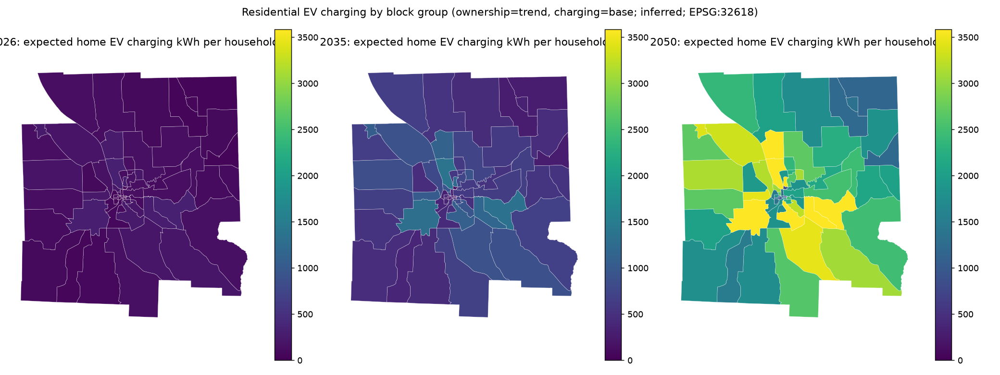
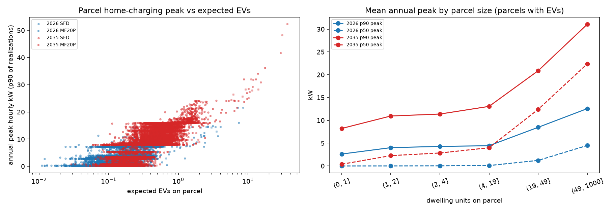
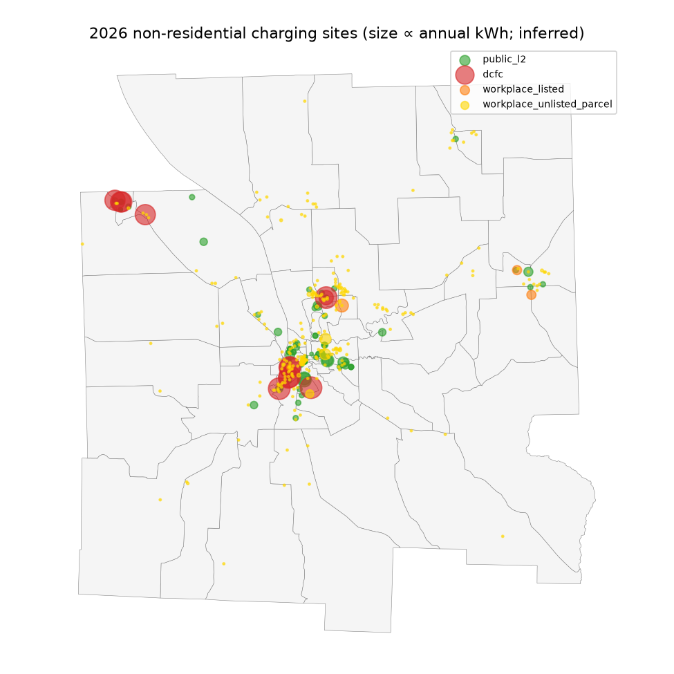
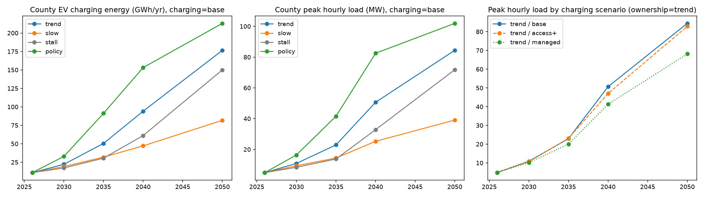
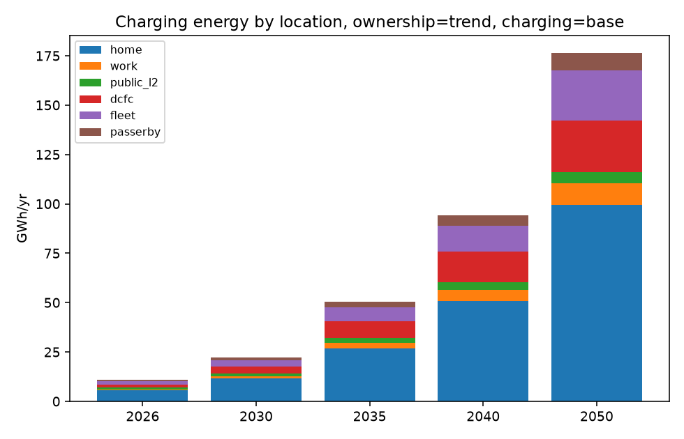
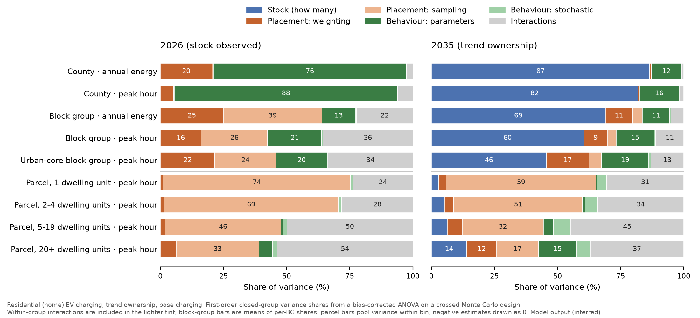

# Reading guide

**Audiences.** Utility planners and retailers: §1, §6–§7. UBEM validation team: §4–§7, `docs/ubem_interface.md`.
Municipal planners: §1, §4.4, §6. Researchers and students: everything, plus `docs/methodology.md`,
`docs/decisions/`, and the code in `src/`.

**Evidence labels** (used on every number): **[A]** local observation · **[B]** New York observation ·
**[C]** national/non-local observation · **[D]** derived/processed observation · **[E]** model output (external) ·
**inferred** = our model result conditional on stated assumptions.
Agreement with a class-E source is a *benchmark*, never *validation*.

**Reproducibility.** Every figure and table is produced by scripts listed in `docs/methodology.md` §1; raw data are
re-acquired by `src/acquisition/*`; provenance manifests are in `metadata/manifests/`.

---

# 1. Executive summary

**What the model does.** It turns public data into hourly EV charging load for every synthetic dwelling unit, parcel,
block group and non-residential charging site in Tompkins County, for 2026 and every year to 2050, under 4 ownership ×
3 charging scenarios, with Monte Carlo uncertainty.

**Status quo (2026).**
- **3,233 plug-in EVs** are registered in Tompkins (1,833 BEV, 1,400 PHEV), **5.4 %** of light-duty vehicles, the
  2nd-highest share of New York's 62 counties. Observed directly at county and ZIP level [A].
- EVs are placed on 43,251 synthetic dwelling units. Central estimate: **21 %** of personal EVs in multifamily housing
  (36 % of households live there); plausible alternatives span 9–31 % because no public data observe EVs below ZIP.
- Charging uses about **10.9 GWh/yr** with a **4.9 MW** county peak on winter weekday evenings: home 53 %,
  fleet depots 16 %, resident DCFC 14 %, public L2 8 %, visitors 5 %, workplace 4 % [inferred].
- A resident EV draws ≈ **3,000 kWh/yr** from the grid (BEV ≈ 4,000, PHEV ≈ 1,800), consistent with survey mileage
  (3,165) and far below NREL TEMPO's implied 7,400 [B/C vs E].

**Projections (trend ownership, base charging).** 22 GWh / 11 MW (2030), 50 GWh / 23 MW (2035),
94 GWh / 51 MW (2040), 176 GWh / 84 MW (2050). Ownership scenarios span 82–213 GWh and 39–102 MW by 2050. Managed
off-peak charging cuts the 2050 county peak by ≈ 19 % but creates a later residential peak 26 % higher than unmanaged.

**Validation.** Stock is observed; area-level placement predicts held-out NY counties' ZIP distribution (≈ 78 %
deviance explained); the synthetic population matches ACS (R² ≥ 0.99); charging shapes match New York measurements
(r = 0.88–0.97); public L2 utilisation (9.6 kWh/port-day) falls within the observed Ithaca range (7.3–16.4). Hourly
residential magnitudes in upstate homes, building-level placement and post-2030 adoption **cannot be validated** with
public data and are reported with explicit uncertainty.

**For UBEM users.** Expected hourly load at any entity level is exact via the profile basis (§5.3,
`docs/ubem_interface.md`); use realizations for building peaks (a single Level 2 EV adds a 7.2 kW hourly peak; a
50+-unit parcel's p90 peak is ≈ 12 kW in 2026 and ≈ 31 kW in 2035).

# 2. Data added in this phase (research plan step 3)

| Source | What it adds | Key numbers | Class |
|---|---|---|---|
| NYSERDA Statewide Multifamily Building Study 2022 (`gjv3-iq86`, `gfhm-wz4s`) | Multifamily parking, EV charging presence, panel capacity by utility region | Upstate NYSEG/RG&E: **84 %** of MF units in buildings with off-street parking (95 % CI 77–89); **5.7 %** of MF buildings with EV charging (2.1–10.0); 82 % of upstate units with ≥100 A panels. MF household EV ownership sample too small for a local rate (8/156 statewide; 0/17 NYSEG+RG&E). | B |
| Drive Clean survey parameter extraction (645 values) | Home access, L1/L2, charging frequency distributions, workplace/public use, cohort trends | BEV: 89 % charge at home, 58 % L2 station (+27 % 240 V outlet), frequency daily/few-weekly/weekly/rare/never = 34/28/20/7/11 %; PHEV 81 % home, 68 % 120 V, 51/15/4/10/19 %; 23 % workplace access (≈⅔ use). **No housing-type breakdowns are published.** | B (self-report, rebate recipients) |
| ACS 2020–2024 PUMS (PUMA 02300 = Tompkins) | Joint household attributes for synthetic dwellings | 2,084 occupied-household records, 43,260 weighted households | A (survey) |
| OneBuilding TMYx 2011–2025 Ithaca (KITH) | Hourly temperature for energy per mile | Jan mean −2.3 °C, Jul 21.9 °C | A (typical year) |
| EValuateNY first appearances + DMV transactions | Inflows of new/used vehicles by drivetrain 2012–2026 | EV share of new light-duty additions: 0.8 % (2013) → 9.5 % (2022) → 12.5 % (12 mo to Aug 2025) → 9.3 % (to Aug 2026) | D/A |
| AFDC historical stations | Unbiased infrastructure growth | see §5.6 (agent-acquired; status noted there) | A |

Details: `docs/source_notes/nyserda_smbs_2022.md`, `docs/source_notes/nyserda_drive_clean_surveys.md`,
`docs/data_sources.md`.

---

# 3. Model overview

The model has three coupled parts, each run for every year 2026–2050 and scenario:

1. **Ownership** — observed ZIP EV totals (2026) placed onto 43,251 synthetic dwelling units; county stock grows
   with a cohort stock–flow model; within-county placement evolves as adoption spreads.
2. **Charging behaviour** — a library of simulated EV-years (energy ledger, temperature, empirical plug-in and dwell
   times) for 52 behavioural archetypes; archetype probabilities depend on dwelling class and year.
3. **Load assembly** — hourly kWh per dwelling unit, parcel, block group and non-residential charging site.

| Scenario axis | Values | Varies |
|---|---|---|
| Ownership growth | `trend`, `slow`, `stall`, `policy` | EV share of new vehicle additions after 2026 |
| Charging | `base`, `access+`, `managed` | home access (multifamily/renters), workplace buildout, off-peak managed charging |

Basic unit: **dwelling unit** (synthetic household on a tax parcel). Parcels act as building proxies; block groups for
mapping and validation; sites for public/workplace/fleet charging.

---

# 4. Ownership model

## 4.1 Observed stock (status quo)

NYS DMV registrations (snapshot 2026-09-02) with VIN-pattern drivetrain decoding (NHTSA vPIC 89.8 %, EValuateNY
lookup 10.2 % of MY2011+ light-duty vehicles):

| Quantity | Value | Class |
|---|---|---|
| Tompkins plug-in EVs (county field, all classes) | **3,233** (1,833 BEV, 1,400 PHEV) | A |
| Share of light-duty vehicles | **5.36 %** (2nd of 62 NY counties; NY 3.14 %) | A/B |
| Personal (PAS light-duty) EVs allocated to housing | 2,875 in Tompkins-area ZIPs (61 at out-of-area addresses) | A |
| Fleet/organizational EVs | ≈ 297 (placed on non-residential parcels) | A |
| DMV `fuel_type = ELECTRIC` | misses essentially all PHEVs (coded GAS) | A — decision 0002 |

## 4.2 Synthetic dwelling units

Parcels (2025 roll) → dwelling-unit counts by property class, calibrated per block group to ACS occupied units by
structure type; each unit receives a PUMS household (tenure, income, vehicles, workers) drawn with weights raked (IPF)
to block-group marginals.

\[
w^{\text{BG}}_h \leftarrow w_h \cdot \frac{T_{c}}{\sum_{h' \in c} w_{h'}} \quad \text{iterated over margins } c \in \{\text{tenure}\times\text{structure},\ \text{tenure}\times\text{vehicles},\ \text{income}\}
\]

| Validation (65 BGs) | R² | SRMSE |
|---|---|---|
| tenure × structure cells | 0.999 | 0.063 |
| tenure × vehicles cells | 0.995 | 0.117 |
| income band cells | 0.994 | 0.065 |
| Total dwelling units | 43,251 vs ACS 43,263 households | — |

Structure composition: single-family detached 52 %, attached 4 %, 2–4 units 14 %, 5–19 units 12 %, 20+ units 11 %,
mobile 7 %. 1,723 ACS units had no parcel of the matching class in their BG and were placed on the nearest class.

## 4.3 Household-class EV propensity (ecological calibration)

Expected EVs in ZIP \(z\) under a mean-field approximation over ACS composition:

\[
\mu_z = e^{\beta_0 + \gamma^\top Z_z}\; I_z \sum_{\tau\in\{\text{own,rent}\}} HH_{z,\tau}\; A_{z,\tau}\; V_{z,\tau},\qquad
EV_z \sim \text{NegBin}(\mu_z, \alpha)
\]
\[
A_{z,\tau} = \sum_g s_{g\mid\tau,z}\, e^{a_{g,\tau}},\qquad V_{z,\tau} = \sum_{v\ge1} s_{v\mid\tau,z}\, v^{\eta},\qquad I_z = \sum_i s_{i,z}\, e^{c_i}
\]

\(Z_z\): standardized log median home value and bachelor's-degree share. Tempered-prior variants set
\(a = \omega \log a^{\text{prior}},\ c = \omega \log c^{\text{prior}}\) (priors from NHTS 2022 and Drive Clean
representation ratios). Validation: 10-fold **county-grouped** cross-validation over 1,361 NY ZIPs, plus a
*within-county allocation* test where held-out county totals are known and distributed across ZIPs.

| Model | Deviance explained vs households-only, 2023 | 2026 | Within-county allocation MAE (EVs/ZIP), fit 2023 → allocate 2026 |
|---|---|---|---|
| M0 households only | 0 | 0 | 68.6 |
| M1 vehicles only | **0.803** | **0.783** | 64.1 |
| M2 priors fixed (NHTS/Drive Clean) | 0.657 | 0.652 | 79.1 |
| M3 free class effects | 0.786 | 0.763 | **62.6** |
| M4 free class effects, no area terms | 0.741 | 0.729 | 75.6 |
| M5 tempered priors (selected) | 0.790 | 0.753 | 63.6 |
| M6 separately tempered | 0.788 | 0.753 | 63.6 |

**Findings.** Once vehicles available and area effects are included, ZIP-level variation places almost no weight on
individual-level housing/tenure/income priors (ω = 0.00 ± 0.07 in 2023; 0.04 ± 0.06 in 2026); EVs scale
sub-proportionally with vehicles (η ≈ 0.5–0.8). Imposing full priors *worsens* allocation below uniform because
multifamily and renter households already have fewer vehicles (double counting). Free class effects are ecologically
confounded (e.g., 2–4-unit owners 0.12×) and are not used for placement. Individual-level NHTS evidence (income
OR 6.7 for ≥$150k vs <$50k; single-family OR 1.3, n.s.) remains the only evidence on *within-area* composition effects.

## 4.4 Allocation to dwelling units (2026)

For ZIP \(z\) with observed personal EVs \(T_z\), each weighting \(w^{(m)}\) gives capped expectations

\[
E^{(m)}_d = \min\!\Big(v_d,\ T_z \frac{w^{(m)}_d}{\sum_{d' \in z} w^{(m)}_{d'}}\Big)\ \text{(excess redistributed)},\qquad
E_d = \tfrac12\big(E^{(\text{model})}_d + E^{(\text{individual})}_d\big)
\]

with \(w^{(\text{model})}_d = e^{\gamma^\top Z_{bg}}\, v_d^{\eta}\) (selected ecological model) and
\(w^{(\text{individual})}_d = v_d \cdot OR_{\text{income}} \cdot OR_{\text{SF}} \cdot OR_{\text{tenure}}\) (NHTS 2022).
Monte Carlo realizations (200 draws) sample vehicle slots without replacement and pick one weighting per draw.

| Share of personal EVs, 2026 | Central | Ecological | Uniform | Vehicles | Individual (NHTS) | Full priors |
|---|---|---|---|---|---|---|
| Multifamily (2+ units) | **20.9 %** | 26.6 % | 30.9 % | 25.4 % | 15.1 % | 9.2 % |
| Renters | **28.0 %** | 35.8 % | 40.9 % | 35.7 % | 20.3 % | 10.4 % |
| Households (for reference) | MF 36.3 % | | | | | |

Block-group totals differ by up to 2–3× across weightings in central Ithaca; sampling uncertainty is 10–50 % of the
mean at BG level. **Reproducing ZIP totals validates nothing below ZIP** (decision 0005).

## 4.5 How concentrated is adoption, and how does it change?

| NY snapshot | EVs / 100 households | Gini across households (ZIP level) | Top-decile ZIP share of EVs | Slope of log ZIP rate on 2023 log rate |
|---|---|---|---|---|
| 2011 | 0.02 | 0.86 | 75 % | 0.32 |
| 2016 | 0.19 | 0.57 | 41 % | 1.16 |
| 2020 | 0.77 | 0.51 | 37 % | 1.04 |
| 2023 | 1.73 | 0.49 | 35 % | 1.00 |
| 2026 | 4.23 | **0.46** | **33 %** | **0.87** |

Adoption becomes less concentrated as penetration rises; relative ZIP differences compress by a factor
\(\varphi \approx 0.87\) over 2023→2026 (≈ 0.90 per doubling of penetration). This exponent drives how placement
converges in projections (§4.7). [D/A]

## 4.6 County growth model

Cohort stock–flow with logistic adoption of new-vehicle additions and Weibull survival:

\[
s(v) = \frac{1}{1+e^{-k(v-t_0)}},\qquad A(v) = N_{\text{new}}\, m\, s(v),\qquad
EV(t) = \sum_v A(v)\, S(t-v-\tfrac12),\qquad S(a) = e^{-(a/\lambda)^{\kappa}}
\]

(\(N_{\text{new}} = 3{,}600\) new light-duty additions/yr, \(\kappa = 3.5\), \(\lambda = 17\) y; \(m\) absorbs net
used-EV imports). BEV share of additions \(b(v)\) is a separate logistic. Calibration uses 2011–2026 stock and
new-vehicle share observations.

| Fit | \(t_0\) | \(k\) | \(m\) |
|---|---|---|---|
| Tompkins, all data | 2032.7 (±1.0) | 0.254 (±0.025) | 1.11 (±0.31) |
| Tompkins, ≤2021 only | 2028.5 | 0.364 | 1.77 |
| New York, all data | 2031.2 | 0.340 | 0.95 |

**Backcast validation** (fit ≤2021, predict later observations):

| Geography | 2023-04 stock | 2026-09 stock | New-vehicle share 2025–26 |
|---|---|---|---|
| New York | +3 % | **+27 %** | — |
| Tompkins | +21 % | **+90 %** | +60 % to +185 % |

Early-diffusion extrapolation overshoots the 2024–26 slowdown (end of the federal tax credit in 2025, observed dip in
new-vehicle EV share). Projections therefore **start from the observed 2026 stock by model year** and use scenario
paths for \(s(y)\) anchored at the observed recent share \(s_{\text{obs}} = 10.9\,\%\).

| Scenario (definition after 2026) | 2030 EVs (p05–p95) | 2035 | 2040 | 2050 | 2050 fleet share |
|---|---|---|---|---|---|
| trend — fitted steepness, \(s_{\max}=1\) | 5,995 (4,683–8,223) | 13,097 | 24,578 | 47,874 | 80 % |
| slow — \(s_{\max}=0.6\), half steepness | 5,249 | 8,388 | 12,397 | 22,161 | 37 % |
| stall — flat until 2030, trend shifted +4 y | 4,752 | 8,020 | 15,975 | 40,681 | 68 % |
| policy — linear to 100 % of additions by 2035 | 8,686 | 23,409 | 39,955 | 57,825 | 97 % |

Parameter uncertainty (400 draws of \(t_0, k, m\); \(N_{\text{new}}\) ±15 %; \(\lambda\) ±2 y) dominates after 2035
(trend 2040 90 % band 14,155–43,521). [inferred / E]

## 4.7 Placement evolution

\[
\pi_z(y) \propto \pi_z(2026)^{\varphi(y)}\, h_z^{1-\varphi(y)},\qquad w_d(y) = w_d^{\varphi(y)},\qquad
\varphi(y) = 0.90^{\log_2\left(EV(y)/EV(2026)\right)}
\]

| Trend scenario | 2026 | 2030 | 2035 | 2040 | 2050 |
|---|---|---|---|---|---|
| Personal EVs in Tompkins-area ZIPs | 2,967 | 5,294 | 11,566 | 21,704 | 42,277 |
| φ | 1.00 | 0.92 | 0.81 | 0.74 | 0.67 |
| Multifamily share of personal EVs | 20.9 % | 21.4 % | 22.2 % | 22.8 % | 23.7 % |
| Households with ≥1 EV (expected) | 6.9 % | 12.2 % | 26.7 % | 47.7 % | 74.1 % |

# 5. Charging model

## 5.1 Parameters by year (`data/processed/charging/parameters_by_year.csv`)

| Parameter | 2026 | 2035 (base / access+ / managed) | 2050 (base) | Evidence |
|---|---|---|---|---|
| Annual miles BEV / PHEV | 10,670 / 10,082 | held | held | B (Drive Clean 2024, self-report) |
| Energy at wheel BEV / PHEV (kWh/mi at 20 °C) | 0.31 / 0.34 | 0.29 / 0.32 | 0.27 / 0.30 | assumption |
| Temperature multiplier \(m(T)\) | \(1 + 0.011\max(0,20-T) + 0.006\max(0,T-25)\) | | | assumption (≈ +30 % at −7 °C) |
| PHEV electric range (mi) | 35 | 45 | 50 | fleet mix, assumption |
| Home access: SF owner / SF renter | 0.95 / 0.75 | 0.96 / 0.80 (access+: 0.88) | 0.97 / 0.85 | B (Drive Clean 89 % BEV) + assumption |
| Home access: 2–4 units / 5+ units | 0.55 / 0.35 | 0.62 / 0.45 (access+: 0.75 / 0.65) | 0.70 / 0.60 | B (SMBS upstate parking 84 %, chargers 5.7 %) + assumption |
| Home L2 share BEV / PHEV (5+ units: 0.8) | 0.80 / 0.28 | 0.88 / 0.40 | 0.92 / 0.50 | B (Drive Clean 58 %+27 % / 24 %) |
| L1 / L2 BEV / L2 PHEV power (kW) | 1.4 / 7.2 / 3.6 | 1.4 / 8.0 / 5.0 | 1.4 / 8.5 / 6.0 | assumption |
| Frequency type BEV daily/few-wk/weekly/rare | 34/28/20/7 (renormalized) | | 30/30/22/8 | B |
| Frequency type PHEV | 51/15/4.4/10 | | same | B |
| Workplace access per worker × use | 0.23 × 0.65 | 0.32 (access+: 0.45) × 0.65 | 0.40 × 0.65 | B |
| Public top-up share (home-access EVs) | 0.08 | 0.07 | 0.06 | assumption |
| Managed share of home L2 sessions | 0 (managed: 0.05) | 0 (managed: 0.35) | 0 (managed: 0.60) | scenario |
| Passer-by share of DCFC energy | 0.25 | 0.25 | 0.25 | assumption |
| Fleet miles/yr; kWh/mi | 14,000; 0.40 | | | assumption |

## 5.2 Event model (one simulated EV-year)

Energy ledger with battery deficit \(D_t\) (kWh at the wheel, \(0 \le D_t \le C\)):

\[
E_t = d_t\, e_{\text{wheel}}(y)\, m(T_t),\qquad
d_t = A\,\frac{g_t\,\mathbb{1}[\text{drive}_t]}{\sum_{t'} g_{t'}\,\mathbb{1}[\text{drive}_{t'}]},\quad g_t \sim \Gamma(1.3,1),\quad A \sim \text{LogN}
\]

Each day: morning driving → workplace opportunity (arrival and dwell sampled from NHTS 2022 work trips, 6.6 kW) →
afternoon driving → public top-up (Boulder L2 / Dundee DCFC session distributions) → home plug-in decision
(probability by frequency type; BEVs forced when \(D > 0.6C\); plug-in time and connection duration sampled jointly
from Norway residential sessions of the same day type). Delivered energy at the plug
\(q = \min(D/\eta_\ell,\; P_\ell \cdot \text{conn})\), charging at constant power from start (managed sessions start at
\(\max(\text{plug-in},\ 23{:}00 + U[0,2]\,\text{h})\) when the window allows). BEVs exceeding \(0.95C\) take an
en-route DCFC session; PHEVs never DC fast charge and switch to gasoline when empty. Hourly energy is the overlap of
each session with each clock hour. 52 archetypes × 60 EV-years per anchor year (2026, 2030, 2035, 2040, 2050).

## 5.3 Assembly into dwelling, parcel, BG and site loads

\[
L_d(t) = E^{\text{BEV}}_d(y)\,\Pi_{k(d),\text{BEV}}(t) + E^{\text{PHEV}}_d(y)\,\Pi_{k(d),\text{PHEV}}(t),\qquad
\Pi_{k,v}(t) = \sum_a P(a\mid k,v,y,c)\,\bar h_a(t)
\]

\[
P(\text{workplace user}\mid k) = 1 - \big(1 - p_{\text{access}}(y)\,p_{\text{use}}\big)^{\text{workers}(k)}
\]

Non-residential pools (resident EVs' workplace, public L2 and DCFC energy, plus fleet and passer-by terms) are
distributed to AFDC public ports, listed and unlisted workplace sites, and fleet parcels (§6.4). Building-peak
uncertainty uses realizations (Poisson EV counts per dwelling, archetype and library EV-year per EV).

## 5.4 Validation of the charging model (2026)

| Check | Result | Reference | Class | Status |
|---|---|---|---|---|
| V1 Home charging frequency, BEV (4 categories) | total variation distance 0.18 | Drive Clean 2024 | B | partly calibrated (category mapping); informative |
| V1 Home charging frequency, PHEV | TVD ≈ 0.00 | Drive Clean 2024 | B | **by construction** (types are inputs) |
| V2 Home session energy and connection time | quantiles within ~10 % | Norway residential sessions | C | connection partly by construction |
| V3 Weekday shape: home vs NY multifamily charging | r = 0.97 | NYSERDA 22-03 Fig. 18 | B | independent |
| V3 Weekday shape: workplace | r = 0.88 | NYSERDA 22-03 | B | shape source is 22-03 (not independent) |
| V3 Weekday shape: public L2 | r = 0.91 | NYSERDA 22-03 | B | independent |
| V4 Public L2 utilisation | **9.6 kWh/port-day** (residents only) | ChargePoint ZIP 14850: 7.3 (2019), 16.4 (2022); NY 22-03 mean 3.3 | A/B | independent, within local range |
| V5 Annual plug energy per resident EV | **2,994 kWh** | Drive Clean miles × efficiency 3,165 | B + assumption | consistent (−5 %) |
| V5 PHEV electric-mile share | ≈ 0.42 | assumed 0.45 earlier | — | plausible |
| V6 Monthly energy index | r = 0.82 | Dundee public (detrended) | C | independent (weak: non-NY) |
| V7 Residential diversity (per-EV annual peak vs N) | between Norway empirical 3.6 kW and 7.2 kW curves | Norway sessions | C | shape consistent |
| V8 County annual energy vs TEMPO | TEMPO/simulated = 2.2; weekday shape r = 0.41 | NREL TEMPO 2022 | **E** | benchmark only |

Tables: `results/tables/charging_validation_*.csv`. Design choices triggered by failed checks are recorded in
decision 0006.

## 5.5 Energy per EV and location shares (research plan step 4)

| Source | kWh per EV-year | Class |
|---|---|---|
| Drive Clean miles × efficiency, Tompkins BEV/PHEV mix | 3,165 (BEV 4,116; PHEV 1,920) | B + assumption |
| NHTS 2022 BEVs (diary miles / self-reported miles) | 4,489 / 4,718 | C (n = 166) |
| Norway residential median user (home energy only) | 1,829 | C |
| **Event model 2026, resident EVs** | **2,994** (BEV ≈ 4,000; PHEV ≈ 1,800) | inferred |
| TEMPO 2022 reference MY2026 per observed EV | 7,421 | E |

Location energy shares of resident EVs are now **model outputs**, not assumptions: home **67 %**, workplace **5 %**,
public L2 **10 %**, DCFC **18 %** (including en-route sessions and BEVs without home access), replacing the earlier
80/7/8/5 assumption. DCFC share is the least constrained quantity (no public NY data).

## 5.6 Charging infrastructure history

AFDC station records *as published on past dates* were retrieved through the public NLR historical-date endpoint
(DEMO_KEY; `src/acquisition/afdc_historical.py`, `docs/source_notes/afdc_historical_stations.md`). Open stations, all
access types, Tompkins by point-in-polygon:

| Year-end | Stations | Ports (all) | Public L2 ports | DCFC ports | EVs per public port |
|---|---|---|---|---|---|
| 2014 | 5 | 8 | 7 | 0 | — |
| 2017 | 13 | 22 | 19 | 2 | 15.2 |
| 2018 | 22 | 42 | 39 | 2 | 12.1 |
| 2019 | 29 | 65 | 53 | 11 | 10.8 |
| 2020 | 34 | 79 | 61 | 11 | 11.7 |
| 2026-09 (current API) | 105 | 290 | 246 open (237 public) | 42 | ≈ 11.7 |

Public L2 ports grew 43 %/yr (2014–2020). The "open date of surviving stations" curve used earlier **understates**
historical infrastructure (2018 public L2: 3 vs 39 ports) because many early station records were retired or re-keyed
(75–92 % of 2014–2017 public records are absent from the latest snapshot). EVs per public port stayed within ≈ 11–15
since 2017, supporting the projection rule that ports scale with the EV stock. AFDC changed its counting method
(OCPI) in 2021, so growth rates spanning 2021 are definitional as well as physical. Snapshots for 2021–2025 are
being acquired under the demo-key rate limit; tables will extend automatically on re-run.

---

# 6. Load results

## 6.1 Status quo (2026; ownership = trend, charging = base)

| Location | Annual MWh | Share |
|---|---|---|
| Home (residential meters) | 5,702 | 52.5 % |
| Workplace | 447 | 4.1 % |
| Public L2 | 831 | 7.7 % |
| DCFC (resident vehicles, incl. en-route) | 1,569 | 14.5 % |
| Fleet depots (≈ 290 organizational EVs) | 1,780 | 16.4 % |
| Passers-by / visitors (DCFC) | 523 | 4.8 % |
| **Total** | **10,851 MWh** | peak **4.9 MW** (weekday evening, late November); residential peak 1.7 MW; load factor 0.25 |

**Buildings / parcels (realizations, 30 draws).** Most parcels host no EV in a given realization; peaks scale
sub-linearly with the number of EVs:

| Dwelling units on parcel | Parcels | Expected EVs | Mean p50 annual peak (kW) | Mean p90 annual peak (kW) | p90 kW per expected EV |
|---|---|---|---|---|---|
| 1 | 16,702 | 0.08 | 0.0 | 0.9 | 10.7 |
| 2 | 4,715 | 0.16 | 0.0 | 2.3 | 13.9 |
| 3–4 | 1,261 | 0.19 | 0.0 | 2.3 | 11.8 |
| 5–19 | 489 | 0.33 | 0.1 | 2.8 | 8.6 |
| 20–49 | 118 | 1.08 | 1.1 | 7.5 | 6.9 |
| 50+ | 54 | 2.77 | 4.3 | 12.1 | 4.4 |

(Table: all parcels with expected EVs > 0. The figure below conditions on parcels that host at least one EV in some
realization, so its means are higher. Stacked hourly profiles above show fleet and DCFC growing strongly by 2050
because both are scaled with the county EV stock.)
A single EV on Level 2 adds a 7.2 kW hourly peak to its home; a 12-EV garage peaks near 29 kW (2.4 kW/EV) and a
48-EV garage near 71 kW (1.5 kW/EV) in the home-charging library. **Use realizations, not expected profiles, for
building-level peak and capacity questions.**

**Non-residential sites (2026).** DCFC: 12 sites, 2.1 GWh, median 143 kWh/port-day, largest site peak 0.69 MW.
Public L2: 90 sites, 0.83 GWh, median 9.6 kWh/port-day. Workplace: 0.45 GWh split between 8 listed sites and 271
large non-residential parcels. Fleet: 1.8 GWh over non-residential parcels (depot locations unknown).

**In-commuting (follow-on analysis, not applied to the load tables).** LEHD LODES 2023 flows [A, noise-infused] show
that 46.8 % of Tompkins's 43,563 primary jobs are held by residents of other counties (mainly Cortland, Tioga, Cayuga,
Chemung, Schuyler). Their EVs are absent from the Tompkins DMV stock, but those counties have passenger EV shares of only
1.1–2.6 % (Tompkins 5.6 %). Screening origins within 100 km, converting jobs to cars with ACS commute modes and applying
the resident workplace parameters and charging library gives ≈ 181 in-commuter EVs and ≈ 33 MWh/yr of charging in
Tompkins in 2026 (bounding cases 16–123 MWh) — 4 % of resident workplace energy and 0.3 % of county charging. Conversely,
≈ 22 % of resident EV owners' jobs (EV-weighted) lie outside the county, yet the model places their workplace charging at
Tompkins sites (≈ 98 MWh). The net correction is negative: −79 MWh/yr for workplace only (−104 to −26), or −146 MWh/yr
(−288 to −3) with a symmetric public-charging assumption, and stays around −1.5 % of load in 2035 [inferred]. Cornell's
central campus block group receives 14 % of in-commuter workplace charging. Details:
`docs/source_notes/lehd_lodes_incommuting.md`, `results/tables/incommuter_*.csv`.

## 6.2 Projections 2030–2050

| Ownership scenario (charging = base) | 2030 GWh / MW | 2035 | 2040 | 2050 |
|---|---|---|---|---|
| trend | 22.1 / 10.9 | 50.5 / 22.9 | 94.1 / 50.7 | 176.4 / 84.4 |
| slow | 19.2 / 9.4 | 31.8 / 14.4 | 47.1 / 25.2 | 81.7 / 39.1 |
| stall | 17.2 / 8.4 | 30.4 / 13.8 | 61.1 / 32.8 | 150.0 / 71.8 |
| policy | 32.8 / 16.4 | 91.2 / 41.6 | 153.2 / 82.5 | 213.0 / 101.9 |

| Charging scenario (ownership = trend) | 2035 total peak / residential peak (MW) | 2050 total peak / residential peak | 2050 DCFC GWh |
|---|---|---|---|
| base | 22.9 / 9.5 | 84.4 / 35.5 | 26.3 |
| access+ (faster multifamily/renter home access, workplace) | 23.1 / 9.4 | 82.8 / 37.2 | 20.4 |
| managed (35 % of home L2 sessions off-peak by 2035, 60 % by 2050) | **20.0** / 10.0 | **68.1** / **44.7** | 26.0 |

**Readings for planners and utilities.**
- County peaks occur on **winter weekday evenings** (17:00–20:00) in all scenarios; the winter cold penalty (+10–30 %
  energy) coincides with the residential evening peak.
- Managed charging lowers the county peak by 13 % (2035) to 19 % (2050) but creates a **later residential peak**
  (23:00–01:00) that exceeds the unmanaged residential peak by 2040; feeder-level assessments need the staggering
  window as a design parameter.
- Better home/workplace access (access+) shifts ≈ 6 GWh/yr (2050) from DCFC sites to homes and workplaces, with little
  change in the county peak.
- Site-level DCFC growth is allocated to today's stations (largest site > 9 MW by 2050 in the trend scenario), which is
  unrealistic; new sites must be sited explicitly in future work.

## 6.3 Where the uncertainty comes from

A fully crossed Monte Carlo design (8,192 model evaluations for 2026, 20,000 for 2035; ownership trend, charging base,
home charging) varies five independent factors: county stock (observed in 2026; ten equal-probability strata of the
growth Monte Carlo in 2035), placement weighting (ecological vs NHTS individual), placement sampling (which dwellings own
EVs), behaviour parameters (home L2 power ×0.85–1.35, energy per mile ×0.85–1.15, annual miles ×0.85–1.25, multifamily
home access ±0.20, Dirichlet frequency mix; `results/tables/uncertainty_factor_ranges.csv`) and stochastic behaviour
(archetype and EV-year per EV). The variance of each load metric \(Y\) is split into Sobol–Hoeffding components on the
design grid, bias-corrected for the finite number of levels \(K_f\):

\[
\hat D_A=\sum_{B\subseteq A}(-1)^{|A|-|B|}\tilde V_B,\qquad
\mathbb{E}[\hat D_A]=\sum_{B\supseteq A} D_B\prod_{f\in A}a_f\prod_{f\in B\setminus A}b_f,\qquad
S_G=\frac{\sum_{\emptyset\neq A\subseteq G}D_A}{\sum_A D_A}
\]

with \(a_f=(K_f-1)/K_f,\ b_f=1/K_f\) for randomly drawn factors and \(a_f=1,\ b_f=0\) for enumerated or stratified ones;
groups \(G\) are stock, placement and behaviour, and the remainder is interaction. Intervals: 200 bootstrap resamples
of the random factors' levels (100 for parcels); a repeat with another seed changes group shares by a median of 0.8
percentage points (largest 14 points, 2026 county peak).

| Year | Scale · metric | Stock | Placement | Behaviour | Interaction |
|---|---|---|---|---|---|
| 2026 | County home energy | 0 | 21 % [14, 34] | **77 %** [63, 84] | 2 % |
| 2026 | County home peak hour | 0 | 6 % [1, 22] | **88 %** [61, 97] | 6 % |
| 2026 | Block group energy (mean of 65) | 0 | **64 %** [61, 67] | 14 % | 22 % |
| 2026 | Block group peak (mean of 65) | 0 | **43 %** [38, 48] | 22 % | 36 % |
| 2026 | Parcel peak: 1 / 2–4 / 5–19 / 20+ units | 0 | **75 / 71 / 48 / 39 %** | 1 / 1 / 2 / 7 % | 24 / 28 / 50 / 54 % |
| 2035 | County home energy | **87 %** [81, 92] | 1 % | 12 % | 1 % |
| 2035 | County home peak hour | **82 %** [74, 90] | 0 % | 16 % | 2 % |
| 2035 | Block group energy / peak (mean of 65) | **69 / 60 %** | 15 / 13 % | 11 / 16 % | 5 / 11 % |
| 2035 | Parcel peak: 1 / 2–4 / 5–19 / 20+ units | 3 / 5 / 6 / 14 % | **62 / 55 / 38 / 28 %** | 4 / 6 / 11 / 20 % | 31 / 34 / 45 / 37 % |

**Readings [inferred].**
- *UBEM validation:* at parcel level most uncertainty is whether a dwelling hosts an EV (55–75 % for 1–4-unit parcels),
  so hourly measurements at a few buildings cannot test the charging model unless EV presence is known. Validate
  behaviour at county or feeder level and placement at block-group level.
- *Utility planning:* for 2035, adoption pace explains 82–87 % of county variance; stock scenarios or bands matter more
  than charging-model refinement. For 20+-unit parcels no single source dominates.
- *Data priorities:* today, home L2 power, mileage and multifamily access (county); sub-ZIP EV location (block groups);
  for 2035, adoption forecasting. Stochastic behaviour alone is < 1 % at county and block-group scale.
- Placement weighting explains 20 % of 2026 county *home* energy but ≈ 0 % of total resident-EV energy: placing EVs in
  multifamily housing moves charging from homes to public chargers rather than changing the total.

Caveats: base charging only; two central weightings (the five-weighting sensitivity is implemented, not run); weather
year, plug-in timing distributions, new construction and dormitory vehicles not varied; φ held at its central value;
2026 county shares rest on 16 parameter draws (wide intervals). Code: `src/analysis/uncertainty_decomposition.py`.

---

# 7. What is validated, what is not

| Component | Validation evidence | Status |
|---|---|---|
| County and ZIP EV stock 2026 | Direct DMV observation, two geographic definitions agree within 3.5 % | **observed** |
| Synthetic dwelling units | ACS BG marginals R² ≥ 0.99 | validated (composition only) |
| Area-level placement between ZIPs | NY county-grouped CV (≈ 0.78 deviance explained), cross-year allocation test | validated between areas |
| Placement below ZIP (building/parcel) | none possible with public data; ensemble spread 9–31 % multifamily share | **unvalidated**, bounded |
| Stock growth | backcast: NY +3 % (2023), +27 % (2026); Tompkins +21 % / +90 % | weak for extrapolation; projections anchored on observed 2026 |
| Charging shapes | NY 22-03 weekday shapes (r 0.88–0.97) | validated (shape, public/MUD) |
| Charging energy magnitude | survey-based kWh/EV (−5 %), local ChargePoint utilisation range | consistent |
| Home charging timing in upstate single-family homes; Level 1 behaviour; DCFC share | no public local data | **unvalidated** |
| County hourly magnitude | only TEMPO (model, 2.2× higher) | benchmark only |
| 2030–2050 load | scenario-conditional | not validatable |

Full matrix: `docs/validation_matrix.md`.

---

# 8. Limitations and next steps

**Most consequential uncertainties for building-level load:** (1) within-ZIP EV placement (multifamily/renter
share), (2) home charging power and plug-in timing in upstate NY homes, (3) DCFC and workplace energy shares,
(4) fleet depot locations and duty cycles, (5) adoption trajectory after 2030 (scenario spread 2.2× by 2050),
(6) managed-charging program design (start-time staggering), (7) students and group-quarters vehicles.

**Recommended next steps (public data):** extend AFDC historical snapshots to 2021–2025 (running); join parcels to
building footprints and RC zones; site-specific DCFC growth scenarios; temperature-dependent annual energy for
specific weather years; sensitivity runs for home L2 power (9.6–11.5 kW) and managed-window width.
**If non-public data become available:** NYSEG/Cornell OptimizEV minute-level home charging, Charge Ready NY site
usage, and utility AMI feeder data would allow the first empirical validation of hourly residential magnitudes.
